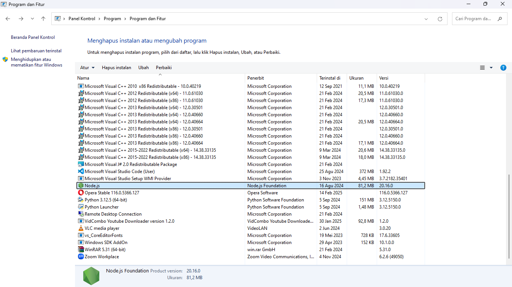
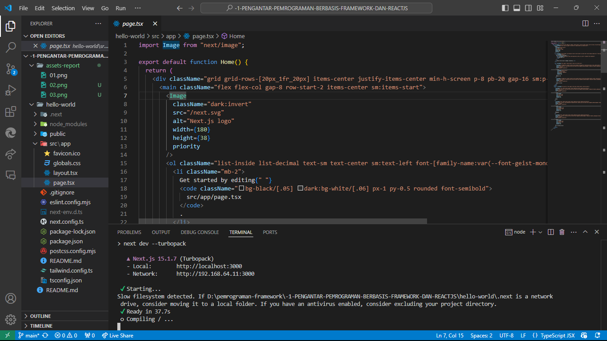
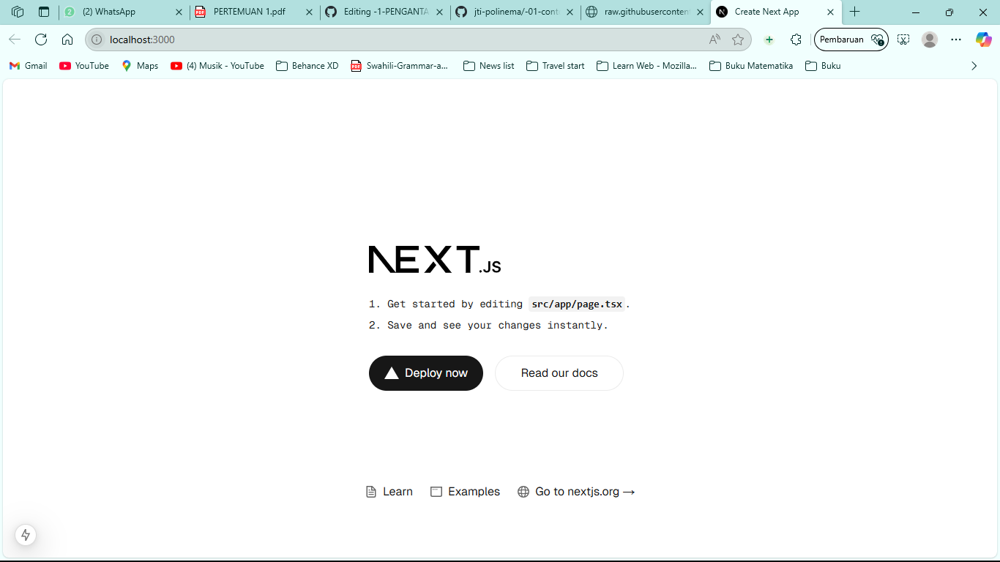

## Laporan Praktikum

|  | Pemrograman Berbasis Framework 2024 |
|--|--|
| NIM |  2241720150 |
| Nama |  Muhammad Paksi Satrio Bayu Dhiyaul Haq |
| Kelas | TI - 3A |

### Praktikum 1

1. Jelaskan kegunaan masing-masing dari Git, VS Code dan NodeJS yang telah Anda install 
pada sesi praktikum ini!

  Git berfungsi untuk mengelola versi suntingan kode program, VS Code merupakan editor yang digunakan untuk mengedit kode program, dan NodeJS merupakan runtime machine untuk mengeksekusi kode JavaScript

2. Buktikan dengan screenshoot yang menunjukkan bahwa masing-masing tools tersebut 
telah berhasil terinstall di perangkat Anda!

### Praktikum 2
1. Pada Langkah ke-2, setelah membuat proyek baru menggunakan Next.js, terdapat beberapa istilah yang muncul. Jelaskan istilah tersebut, TypeScript, ESLint, Tailwind CSS, App Router, Import alias, App router, dan Turbopack
  Cek

2. 

